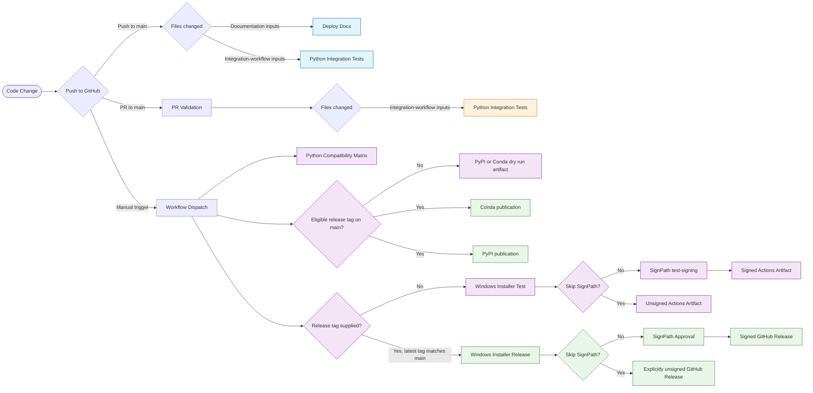

# Repository Maintainers

This document outlines the best practices and guidelines for maintainers of the BERA Tools repository on GitHub. It covers:

- branch protection
- GitHub Actions workflows
- security features
- branching strategies

Maintainers play a crucial role in ensuring the quality and security of the codebase. Following these guidelines will help
to ensure a smooth and secure development process.

## Protect Branches

branch protection rules help us enforce certain workflows in our repository. We can use them to:

- Apply protection to main branch
- Require pull requests before merging
- Require 1 approving review
- Require status checks (CI) to pass before merge
- Dismiss stale approvals when new commits are pushed
- Prevent force pushes and branch deletion (restrict to admins)
- Limit merge types (e.g., enable only squash merges to keep history clean)

## Actions

GitHub Actions allow you to automate workflows directly in our repository.
BERA Tools uses GitHub Actions for CI/CD pipelines, including:

Here is a summary of the actions defined in all workflow files in `.github/workflows`, grouped by trigger type:

### Push to main

- __mkdocs-gh-pages.yml__
    - Summary: Zensical validation and deployment workflow for documentation inputs.
    - Trigger: On pull requests and pushes to `main` affecting documentation, its dependencies, or the workflow.
    - Builds with Zensical and deploys the generated artifact to GitHub Pages on pushes.

### Automatic integration tests

- __python-integration-tests.yml__
    - Summary: Workflow integration tests using Pixi and pytest.
    - Trigger: On pushes to `main` and qualifying pull requests targeting `main` when application, test, Pixi/project configuration, or workflow files change.
    - Runs `tests/test_workflow.py` in the Pixi-managed Python 3.12 environment with terminal coverage reporting.

### Manual (workflow_dispatch)

- __python-compatibility-tests.yml__
    - Summary: Manual Python compatibility grid using tox inside micromamba environments with conda-forge GDAL.
    - Trigger: Manually triggered via `workflow_dispatch`.
    - Runs `tests/test_workflow.py` through tox under Python 3.12, 3.13, and 3.14 without relying on Ubuntu apt GDAL.

- __build-win-installer.yml__
    - Summary: Builds the Windows installer in test or release mode, with signing currently off by default.
    - Trigger: Manually triggered via `workflow_dispatch` on the selected branch.
    - With signing enabled and no release tag, uses `test-signing` and uploads test-signed Actions artifacts without publishing a GitHub Release.
    - With signing enabled and a release tag, requires `main`, verifies that the latest numeric tag points exactly to the dispatched commit, uses `release-signing`, and attaches the approved installer to that GitHub Release.
    - **Skip SignPath** is checked by default. Unsigned Actions artifacts are retained; a validated latest release tag also publishes a `-unsigned.exe` asset with unsigned release notes. Uncheck it to enable signing. Signing failures do not activate this option automatically.

- __publish_to_anaconda.yml__
    - Summary: Builds and smoke-tests Conda packages, publishes eligible releases to Anaconda.org, and attaches test data to GitHub Releases.
    - Trigger: Manually triggered via `workflow_dispatch` on the selected branch; pushing a version tag does not start this workflow.
    - With no release tag, runs a non-publishing build and smoke test and uploads the Conda package as an Actions artifact.
    - With a release tag, publishes only from `main` when the latest numeric tag points exactly to the dispatched commit.

- __publish_to_pypi.yml__
    - Summary: Builds and checks PyPI distributions, then publishes eligible manually selected releases.
    - Trigger: Manually triggered via `workflow_dispatch`; pushing a version tag does not start this workflow.
    - With no release tag, checks distribution metadata and uploads the packages as a dry-run Actions artifact.
    - With a release tag, publishes only from `main` when the latest numeric tag points exactly to the dispatched commit and both package versions match. A valid but ineligible tag becomes a dry run; malformed or missing tags fail validation.

See [Publishing BERA Tools](publishing.md#windows-installer-signing) for the signing and release procedure.

To check release guards locally without publishing, run `pixi run python tests/check_publish_workflows.py`. This executes the workflow's Bash and PowerShell scripts in a disposable Git repository and checks unsigned installer labeling. Bash and PowerShell 7 (`pwsh`) must be installed; on Windows, the check uses Git Bash.

### Configuration

There are security measures in place to restrict actions to be used. Find these in: Repository Settings -> Actions -> General --> Actions permissions:

  

GitHub has been configured to use repository secrets for sensitive information such as API tokens and credentials required by the workflows. Find these in: Repository Settings -> Secrets and variables -> Actions --> Repository secrets:

  

Windows signing requires the `SIGNPATH_API_TOKEN` and `SIGNPATH_ORGANIZATION_ID` repository secrets. The SignPath action must also remain allowed under Repository Settings -> Actions -> General -> Actions permissions. Explicit unsigned builds skip SignPath and do not use those secrets. Secret values must never be added to source control or documentation.

PyPI uses trusted publishing for owner `BERATool`, repository `beratools`, workflow `publish_to_pypi.yml`, and no GitHub environment. Update the PyPI publisher registration after a repository transfer.

### Actions Flow

## Secure our repository

Our repository is using GitHub's available security features to protect our code from vulnerabilities, unauthorized access, and other potential security threats. These features include:

- Dependabot alerts notify of security vulnerabilities in BERA Tools dependency network, so that we can update the affected dependency to a more secure version.
- Secret scanning scans our repository for secrets (such as API keys and tokens) and alerts us if a secret is found, so that we can remove the secret from our repository.
- Push protection prevents we (and our collaborators) from introducing secrets to the repository in the first place, by blocking pushes containing supported secrets.
- Code scanning identifies vulnerabilities and errors in our repository's code, so that we can fix these issues early and prevent a vulnerability or error being exploited by malicious actors.

Find these settings in: Repository Settings -> Advanced Security

  

  

## Branching based workflow

To streamline collaboration, we recommend that regular collaborators work from a single repository, creating pull requests between branches instead of between repositories.

Forking is best suited for accepting contributions from people that are unaffiliated with a project, such as open-source contributors.

To maintain quality of main branch, while using a branching workflow, we use protected branches with required status checks and pull request reviews.
